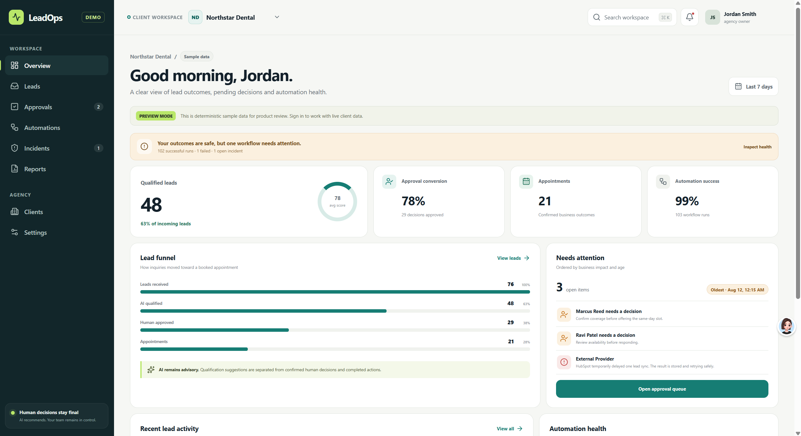
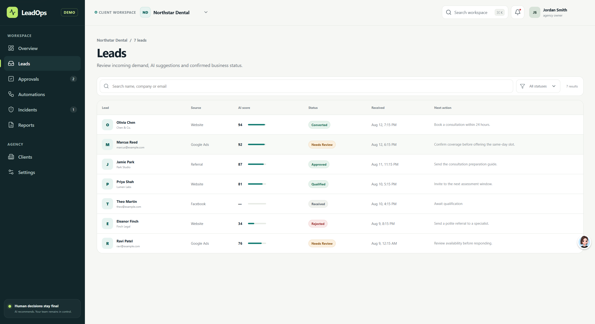
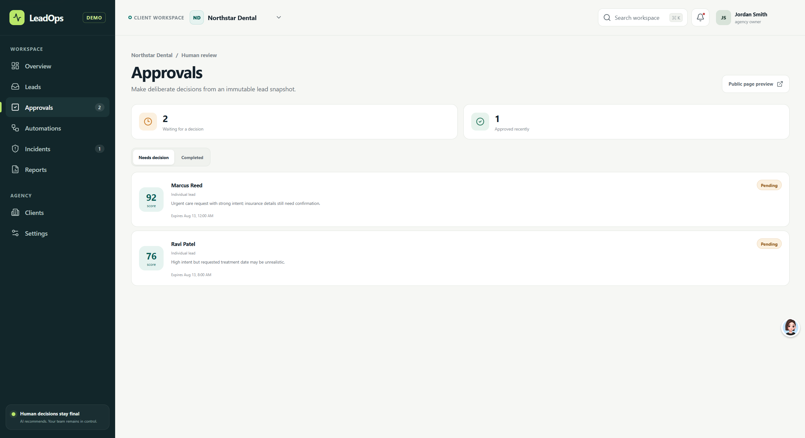
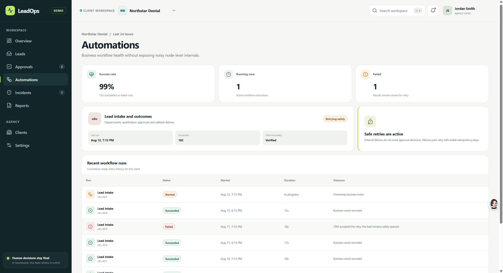
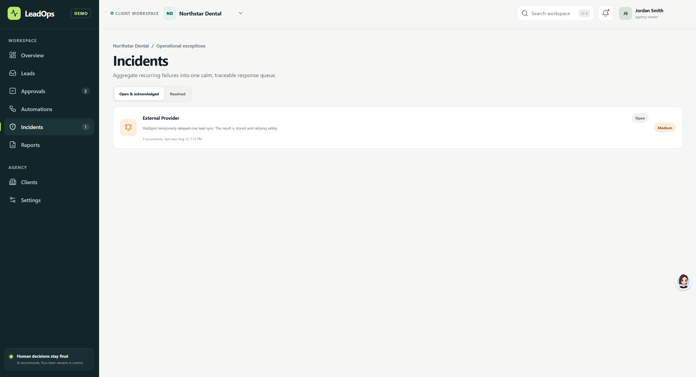

# LeadOps Portal

LeadOps Portal runs the complete operational path from an incoming lead to qualification, human approval, automated execution, incident recovery, and reporting in one multi-tenant control plane.

It gives an automation agency one place to see what entered the system, what needs a decision, what ran, what failed, and what recovered—without losing tenant boundaries or trusting unreliable callbacks.

**Why it matters**

- Duplicate or replayed events do not create duplicate work.
- Automation cannot silently bypass a required human decision.
- Failed jobs become visible incidents with retry and recovery paths.
- Tenant context stays attached from request handling through persistence and background execution.



| Leads                                  | Human approvals                           |
| -------------------------------------- | ----------------------------------------- |
|  |  |

| Automations                                        | Incidents                                      |
| -------------------------------------------------- | ---------------------------------------------- |
|  |  |

## End-to-end ownership

I independently defined the product, designed the architecture and data boundaries, planned and reviewed the implementation, designed the acceptance strategy, and owned final delivery from requirements to a verified system.

## System highlights

- Responsive Next.js control plane for leads, clients, approvals, automations, incidents, reports, and settings
- PostgreSQL multi-tenancy with row-level-security-oriented data access
- Signed webhook ingestion, replay protection, idempotency, and secret rotation
- Configurable qualification provider boundary and normalized scoring results
- One-time approval links, immutable decision history, and expiration controls
- n8n workflow contracts with authenticated callbacks and human-in-the-loop stops
- Durable worker jobs, delivery retries, incident creation, and structured observability
- Docker deployment targets for web, worker, and migrations
- Unit, database, integration, and end-to-end verification suites

## Architecture

```text
Lead sources / n8n
        |
        v  signed + idempotent events
Next.js application / API routes
        |
        +---- PostgreSQL ---- tenant-scoped product data
        |          |
        |          +---- outbox / durable jobs
        |
        +---- Worker ---- notifications / callbacks / incident handling
                          |
                          +---- provider interfaces
```

Tenant context is carried through request handling and persistence. Automation does not bypass human decisions: approval records and tokens form an explicit boundary before a workflow may continue.

## Repository map

| Path                     | Purpose                                         |
| ------------------------ | ----------------------------------------------- |
| `apps/web`               | Product UI and application API routes           |
| `apps/worker`            | Durable background execution                    |
| `packages/db`            | Schema, migrations, and tenant data access      |
| `packages/contracts`     | Shared domain and API contracts                 |
| `packages/events`        | Signing, verification, and event primitives     |
| `packages/observability` | Logging, traces, redaction, and safe errors     |
| `packages/n8n`           | Workflow integration contracts                  |
| `tests`                  | Cross-service integration and end-to-end suites |
| `docker`                 | Production-oriented container targets           |
| `docs/architecture`      | System architecture reference                   |

## Local verification

Requirements: Node.js 22+, pnpm 11.18.0, and Docker for database-backed suites.

```bash
pnpm install --frozen-lockfile
pnpm lint
pnpm typecheck
pnpm test
pnpm build
pnpm test:db
pnpm test:integration
pnpm test:e2e
```

See [`docs/architecture/leadops-saas-architecture.md`](docs/architecture/leadops-saas-architecture.md) and the runbooks under [`docs/runbooks`](docs/runbooks).

### Verified snapshot — 2026-08-24

- Lint, type checking, shared-package prebuild, and the production application build passed.
- 460 unit and component-level tests passed.
- 152 PostgreSQL migration, RLS, concurrency, and persistence tests passed.
- 36 cross-service integration tests passed.
- 13 end-to-end workflow tests passed, including signed event ingestion, qualification, human approval, callback retry, email delivery, incidents, and reporting.
- Gitleaks 8.30.0 reported no leaks in the curated snapshot.
- The production dependency audit passed the high-severity gate: 0 high, 0 critical, and 1 current moderate transitive advisory in an optional development-server path.

## Scope and disclosure

- Screenshots use synthetic demonstration data.
- Provider credentials and production infrastructure are not included.
- Production use requires independent security, compliance, deliverability, and operational review.

## Source terms

The project code is shared for portfolio evaluation and technical review. It is not offered under an open-source license. Third-party packages retain their own licenses; see [`docs/open-source-inventory.md`](docs/open-source-inventory.md) and [`LICENSE`](LICENSE).
