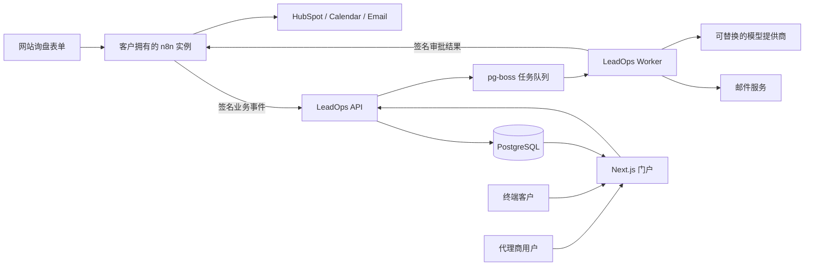
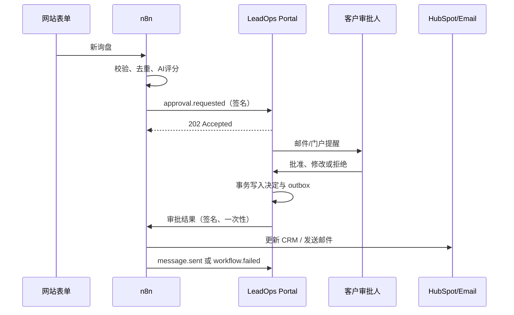

# LeadOps Portal：完整系统架构与开发蓝图

版本：v1.0  
日期：2026-08-02  
目标：开发一个面向 AI 自动化代理商的多租户线索运营门户，用同一套产品同时证明 SaaS 架构、n8n 自动化、AI 结构化判断、人工审批、事故处理和生产可靠性。

---

## 1. 最终产品定义

工作名称：**LeadOps Portal**

英文销售描述：

> White-label lead operations and human approval portal for n8n automation agencies.

第一版只服务一个明确场景：

```text
网站询盘
→ 数据校验和去重
→ AI 线索评分与摘要
→ 客户人工审批
→ HubSpot CRM
→ 日历预约或跟进邮件
→ 业务面板、事故记录和周报
```

它不做通用工作流编辑器，也不尝试复制 n8n。门户是“业务结果与人工决策层”，n8n 是“执行与集成层”。

### 1.1 目标用户

- Agency Owner：代理商老板，管理团队、客户和总体健康状况。
- Agency Operator：代理商交付人员，接入和维护工作流、处理事故。
- Client Approver：代理商终端客户的负责人，审核 AI 判断和对外动作。
- Client Viewer：客户只读人员，只看指标、记录和报告。

### 1.2 第一版成功标准

产品必须让一名没有技术背景的客户在十秒内回答：

1. 今天收到了多少线索？
2. 哪些线索值得跟进？
3. 哪些事项等待我审批？
4. 自动化有没有漏掉业务？
5. 这套自动化产生了什么可见结果？

---

## 2. 系统边界

### 2.1 门户负责

- 用户、组织、客户和权限；
- 业务事件接收与保存；
- 线索、执行、审批、事故和审计记录；
- 业务指标和周报；
- 审批结果安全回传；
- AI 调用记录、成本和可解释结果；
- 简单白标：名称、Logo、主色；
- 后续的订阅和用量限制。

### 2.2 n8n 负责

- 表单、邮件、HubSpot、日历等第三方集成；
- 确定性的数据转换和业务路由；
- 等待审批后继续执行；
- 出错时向门户发送标准事件；
- 客户自己的第三方凭据。

### 2.3 第一版明确不负责

- 不嵌入或白标 n8n 编辑器；
- 不在门户中编辑 n8n 节点图；
- 不把不同客户的第三方密钥集中存进门户；
- 不同时深度集成 Make、Zapier、Vapi、Retell；
- 不做复杂自定义报表生成器；
- 不做手机原生 App；
- 不允许 AI 自动修改生产工作流；
- 不允许用户输入任意回调 URL 后由服务器访问。

---

## 3. 推荐架构



### 3.1 采用模块化单体，不先做微服务

代码仓库保持一个 monorepo，但部署为两个进程：

```text
apps/web       Next.js 页面、认证和 HTTP API
apps/worker    后台任务、审批回调、邮件、AI 摘要和周报
packages/db    Drizzle schema、迁移、RLS 和查询封装
packages/core  领域类型、状态机和权限
packages/events 事件 schema、签名和幂等处理
packages/email React Email 模板
packages/n8n   n8n 事件、回调和模板工具
```

这样可以避免早期微服务复杂度，同时保证 Web 请求和长时间任务不会相互阻塞。

### 3.2 技术栈

| 层 | 选择 | 原因 |
|---|---|---|
| Web | Next.js + TypeScript | 同一项目完成页面、API、SSR 和演示站 |
| UI | Tailwind CSS + shadcn/ui | 组件源码可直接修改，MIT |
| 数据库 | PostgreSQL | 多租户、事务、审计和分析能力可靠 |
| ORM | Drizzle ORM | 类型清晰、SQL 透明、适合迁移和 RLS |
| 认证 | Better Auth | MIT、自托管、会话和组织能力齐全 |
| 队列 | pg-boss | 复用 PostgreSQL，不需要第一天引入 Redis |
| 输入验证 | Zod | Webhook、表单、AI 输出共用 schema |
| 图表 | Recharts | 足够完成线索漏斗和趋势图 |
| 邮件模板 | React Email | 邀请、审批提醒、周报共用 React 组件 |
| AI 接口 | Vercel AI SDK | 提供商无关，便于换模型和结构化输出 |
| 测试 | Vitest + Playwright + pgTAP | 覆盖领域逻辑、RLS、API 和完整用户流程 |
| 可观测性 | Pino + OpenTelemetry | 结构化日志和供应商无关的追踪 |
| 本地运行 | Docker Compose | 一条命令运行 Web、Worker、Postgres、n8n、Mailpit |

---

## 4. 开源复用方案

### 4.1 直接采用或复制后修改

| 项目 | 许可证 | 用法 |
|---|---|---|
| [nextjs/saas-starter](https://github.com/nextjs/saas-starter) | MIT | Fork 为基础，复用 Next.js、Drizzle、团队后台、活动日志、Stripe 和 shadcn 结构 |
| [Better Auth](https://github.com/better-auth/better-auth) | MIT | 替换 starter 中较简单的手写认证，使用 session、organization、invitation 能力 |
| [shadcn/ui](https://github.com/shadcn-ui/ui) | MIT | 表格、弹窗、表单、侧栏、空状态和 Toast |
| [pg-boss](https://github.com/timgit/pg-boss) | MIT | 后台任务、自动重试、死信和定时周报 |
| [Standard Webhooks](https://github.com/standard-webhooks/standard-webhooks) | Apache-2.0 | Webhook 请求头、签名、时间戳和密钥轮换约定 |
| [AgeniusDesk CE](https://github.com/Mfrostbutter/ageniusdesk-ce) | MIT | 复用其 n8n 错误处理工作流 JSON、错误分类思路和执行映射；不复制完整控制台 |
| [React Email](https://github.com/resend/react-email) | MIT | 邀请、审批、事故和周报邮件 |
| [Recharts](https://github.com/recharts/recharts) | MIT | 线索漏斗、趋势和成功率图表 |
| [Vercel AI SDK](https://github.com/vercel/ai) | Apache-2.0 | 模型提供商适配和结构化生成 |
| [Zod](https://github.com/colinhacks/zod) | MIT | 事件、API 和 AI 输出校验 |
| [Playwright](https://github.com/microsoft/playwright) | Apache-2.0 | 端到端测试 |

### 4.2 只参考，不复制

| 项目 | 原因 |
|---|---|
| [AutoMaestro](https://github.com/TeoMastro/AutoMaestro) | GPLv3。闭源发布或交付自托管版本时会增加源代码披露义务；只研究产品流程，不复制代码。 |
| [OpenStatus](https://github.com/openstatusHQ/openstatus) | AGPLv3。若将其代码嵌入网络服务，合规负担较大；需要时作为独立部署服务使用。 |
| [BoxyHQ SaaS Starter](https://github.com/boxyhq/saas-starter-kit) | Apache-2.0 允许复用，但基础依赖和最近正式版本较旧；只借鉴邀请、审计和权限交互。 |

### 4.3 禁止用于商业产品

| 项目 | 原因 |
|---|---|
| [FlowEngine](https://github.com/FlowEngine-cloud/flowengine) | LICENSE 在 MIT 文本后追加 Commons Clause 和额外限制，明确禁止商业嵌入、功能抽取、白标和竞争性 SaaS。不能复制代码。 |
| n8n 编辑器源码 | n8n 是 fair-code。第一版只通过客户拥有的实例和 Webhook 协作，不嵌入、不重售、不托管多客户工作流。商业嵌入应另购 Embed 许可。 |

### 4.4 开源合规做法

仓库增加：

```text
LICENSE
THIRD_PARTY_NOTICES.md
docs/open-source-inventory.md
```

每次引入代码时记录：

- 仓库 URL；
- 固定 commit SHA；
- 许可证；
- 复制或修改的文件；
- 本项目中的用途；
- 是否需要保留版权声明；
- 后续安全更新责任人。

CI 增加许可证扫描，拒绝未经确认的 AGPL、Commons Clause、SSPL 和未知许可证依赖进入生产包。

---

## 5. 多租户和权限模型

### 5.1 层级

```text
Platform
└── Organization / Agency
    ├── Agency Members
    ├── Client A
    │   ├── Client Members
    │   └── Workflows
    └── Client B
        ├── Client Members
        └── Workflows
```

### 5.2 角色

| 角色 | 主要权限 |
|---|---|
| platform_admin | 处理平台支持；默认不能读取客户业务正文，只能在审计授权下临时访问 |
| agency_owner | 账单、组织设置、所有客户、成员和工作流 |
| agency_admin | 客户、成员、工作流、审批和事故；不能转移所有权 |
| agency_operator | 被分配客户的工作流、审批和事故处理 |
| client_approver | 自己客户空间内查看并决定审批 |
| client_viewer | 自己客户空间内只读 |

第一版一个成员只需要一个最高角色，不实现多个角色叠加。

### 5.3 数据隔离原则

- 所有领域表必须包含 `organization_id`。
- 客户级表同时包含 `client_id`。
- 禁止只根据 URL 中的 `client_id` 查询。
- 每次请求先验证 session、组织成员关系和客户分配。
- 所有领域查询必须通过 `withTenantContext()` 执行。
- PostgreSQL 使用 `SET LOCAL app.user_id` 和 `SET LOCAL app.organization_id`，并通过 RLS 做第二层隔离。
- 后台 Worker 使用独立数据库角色；每个任务必须携带并验证 `organization_id`。
- 测试必须证明 A 组织无法 SELECT、UPDATE、DELETE B 组织的任何记录。

---

## 6. 数据模型

### 6.1 身份与租户

```text
users
sessions
accounts
organizations
organization_members
organization_invitations
clients
client_members
client_assignments
```

### 6.2 自动化与业务

```text
integrations
integration_secrets
workflows
workflow_runs
business_events
leads
appointments
approvals
approval_deliveries
incidents
incident_events
ai_runs
report_snapshots
audit_logs
outbox
```

### 6.3 关键约束

- `business_events(integration_id, external_event_id)` 唯一，防止重复处理。
- `workflow_runs(workflow_id, external_execution_id)` 唯一。
- `approvals` 同一 `external_execution_id + action_key` 只能有一个活动审批。
- 审批决定使用乐观锁或条件更新：只有 `pending` 才能转为 `approved/rejected`。
- `audit_logs` 只允许 INSERT，不允许普通用户 UPDATE/DELETE。
- `integration_secrets` 只保存密文、密钥版本和末四位，不把明文返回浏览器。
- 组织、客户和工作流之间使用复合外键，防止不同租户 ID 被错误拼接。

### 6.4 事件优先设计

原始 `business_events` 作为不可变事实记录，`leads`、`workflow_runs`、`incidents` 是投影结果。

优点：

- 事件处理代码升级后可以重放；
- 新增 Make 或 Zapier 时不需要改业务数据库；
- 可以解释一个指标由哪些原始事件得出；
- 重复 Webhook 不会制造重复业务结果；
- 事故调查时保留原始输入。

原始事件要设置保存期限，敏感正文与统计元数据分开保存。

---

## 7. Webhook 契约

### 7.1 请求头

遵循 Standard Webhooks：

```http
webhook-id: evt_01J...
webhook-timestamp: 1785600000
webhook-signature: v1,base64-signature
content-type: application/json
```

### 7.2 事件正文

```json
{
  "type": "lead.qualified",
  "timestamp": "2026-08-02T10:00:00Z",
  "schema_version": "1.0",
  "source": "n8n",
  "client_external_id": "demo-hvac",
  "workflow_external_id": "lead-intake-v1",
  "execution_external_id": "n8n-exec-123",
  "data": {
    "lead_external_id": "lead-9831",
    "score": 86,
    "fit": "high",
    "urgency": "this_week",
    "summary": "Commercial HVAC replacement request",
    "recommended_action": "book_consultation",
    "estimated_value": 12000,
    "currency": "USD"
  }
}
```

### 7.3 第一版事件类型

```text
workflow.started
workflow.succeeded
workflow.failed
lead.received
lead.qualified
lead.unqualified
approval.requested
appointment.booked
message.sent
cost.recorded
```

### 7.4 接收流程

1. 读取原始请求 body；
2. 根据接入标识找到加密密钥；
3. 校验时间戳，默认拒绝超过五分钟的请求；
4. 恒定时间比较 HMAC；
5. 使用 Zod 校验对应版本的事件 schema；
6. 在一个事务中保存事件和 outbox 任务；
7. 唯一键冲突时返回成功但不重复处理；
8. 立即返回 `202 Accepted`；
9. Worker 异步更新投影、指标和通知。

---

## 8. 人工审批架构



### 8.1 审批状态机

```text
pending
├── approved → delivering → delivered
│                         └→ delivery_failed → retrying
├── rejected
├── expired
└── cancelled
```

### 8.2 安全要求

- 审批按钮不能直接从浏览器调用 n8n。
- 用户决定先写数据库，再由 Worker 回调。
- n8n 回调地址加密保存，且 host 必须属于该 integration 的 allowlist。
- 禁止访问 localhost、私网 IP、云元数据地址和重定向到非允许域名，防止 SSRF。
- 回调带 HMAC、审批 ID、时间戳和幂等键。
- 每个审批只允许一次最终决定。
- 修改后批准必须保存原始内容、修改后内容和差异。
- 所有高风险对外消息第一版都要求人工批准。

---

## 9. n8n 示例工作流

不要从空白开始。以 n8n 官方模板 [Qualify website leads with OpenAI and HubSpot and notify via Gmail](https://n8n.io/workflows/15648-qualify-website-leads-with-openai-and-hubspot-and-notify-via-gmail/) 为业务参考，在自己的仓库中重新整理为可测试模板。

### 9.1 主工作流节点

```text
Webhook/Form Trigger
→ Normalize Input
→ Validate Required Fields
→ Deduplicate Lead
→ Emit lead.received
→ AI Structured Qualification
→ Validate AI Output
→ Switch Score
   ├── High: Create/Update HubSpot → Request outbound approval
   ├── Medium: Request qualification approval
   └── Low: Emit lead.unqualified
→ Wait for Approval
→ Approved: Update CRM / Send Email / Book Calendar
→ Rejected: Record outcome
→ Emit workflow.succeeded
```

### 9.2 子工作流

```text
emit-business-event.json
request-approval.json
emit-error.json
normalize-lead.json
```

这些子工作流只接受结构化输入，所有签名逻辑集中在一个 Code 节点中，避免每个工作流复制不同实现。

### 9.3 AI 输出 schema

```json
{
  "score": 0,
  "fit": "high | medium | low",
  "urgency": "immediate | this_week | this_month | unknown",
  "service_category": "string",
  "summary": "string",
  "reasons": ["string"],
  "risk_flags": ["string"],
  "recommended_action": "approve | review | reject",
  "draft_reply": "string"
}
```

模型输出必须经过 schema 校验。校验失败时不猜测，不自动发送，进入人工审批或确定性降级流程。

---

## 10. Web 产品页面

### 10.1 代理商端

```text
/dashboard
/clients
/clients/[clientId]
/workflows
/runs
/approvals
/incidents
/reports
/team
/settings/branding
/settings/integrations
```

### 10.2 客户端

```text
/portal/[clientSlug]/overview
/portal/[clientSlug]/leads
/portal/[clientSlug]/approvals
/portal/[clientSlug]/incidents
/portal/[clientSlug]/reports
```

### 10.3 仪表盘只显示业务指标

- Leads received；
- Qualified leads；
- Qualification rate；
- Appointments booked；
- Pending approvals；
- Failed or delayed items；
- Estimated pipeline value；
- Last successful business event。

执行时长、节点名称、原始堆栈等技术指标只显示在代理商操作端。

---

## 11. HTTP API

### 11.1 机器接口

```text
POST /api/v1/events
POST /api/v1/approvals/requests
POST /api/v1/integrations/test
GET  /api/v1/health
```

### 11.2 用户接口

```text
GET  /api/v1/clients
GET  /api/v1/clients/:id/metrics
GET  /api/v1/leads
GET  /api/v1/leads/:id
GET  /api/v1/approvals
POST /api/v1/approvals/:id/decision
GET  /api/v1/incidents
POST /api/v1/incidents/:id/acknowledge
POST /api/v1/incidents/:id/retry
GET  /api/v1/reports/:period
```

### 11.3 API 约定

- 所有写接口接受 `Idempotency-Key`；
- 分页使用 cursor，不使用大页码 offset；
- 错误返回统一 problem details；
- 所有时间为 UTC ISO 8601；
- 金额保存整数最小货币单位；
- 外部 ID 和内部 UUID 分离；
- OpenAPI 文档由代码 schema 生成，不手写两份定义。

---

## 12. 后台任务

pg-boss 队列：

```text
project-business-event
deliver-approval
retry-approval-delivery
summarize-incident
send-transactional-email
generate-weekly-report
rebuild-client-metrics
expire-approvals
purge-expired-payloads
```

每个任务必须：

- 有确定性 job key；
- 有最大重试次数和指数退避；
- 记录 organization/client；
- 区分可重试错误和永久错误；
- 超过次数后进入 dead letter；
- 管理员可以查看失败原因，但不能任意执行代码。

---

## 13. AI 使用边界

AI 只负责：

- 线索内容分类和摘要；
- 生成跟进草稿；
- 把技术错误转成非技术说明；
- 生成周报文字摘要。

AI 不负责：

- 判断用户有没有权限；
- 决定租户数据范围；
- 直接发送高风险消息；
- 直接修改 CRM 中的关键金额；
- 自动修改 n8n 工作流；
- 执行模型生成的任意代码。

`ai_runs` 记录：

```text
provider
model
prompt_version
input_hash
output_schema_version
latency_ms
input_tokens
output_tokens
estimated_cost
status
fallback_used
```

不要默认永久保存完整 prompt 和客户原文；生产环境应支持脱敏和保存期限。

---

## 14. 完整开发过程

以一名有全栈经验、使用 AI 辅助开发的开发者估算：15–22个有效工作日。没有 Next.js/Postgres/n8n 经验时按4–6周安排。

### Sprint 0：冻结范围（1天）

交付：

- 一页产品定义；
- 用户角色；
- 第一版页面；
- 事件 schema v1；
- 明确不做清单；
- 一个虚构 Demo Agency 和两个 Demo Client。

退出条件：任何新功能必须替换已有功能，不能只追加范围。

### Sprint 1：仓库与开发环境（1–2天）

任务：

1. Fork `nextjs/saas-starter`，记录 commit SHA；
2. 保留原 LICENSE，建立 THIRD_PARTY_NOTICES；
3. 建立 monorepo 目录；
4. 配置 TypeScript strict、ESLint、格式化和环境变量校验；
5. Docker Compose 启动 Postgres、Mailpit 和 demo n8n；
6. GitHub Actions 跑 lint、typecheck、unit test 和 build；
7. 禁止测试账号和默认密码进入生产 seed。

退出条件：全新机器按 README 可在15分钟内运行。

### Sprint 2：认证、多租户与 RLS（3天）

任务：

1. 用 Better Auth 替换简单认证；
2. 建立 organization、member、invitation；
3. 建立 client 和 client_member；
4. 实现六种角色权限；
5. 实现 `withTenantContext()`；
6. 给所有领域表开启 RLS；
7. 编写跨租户 pgTAP 和 API 测试；
8. 实现审计日志基础设施。

退出条件：恶意修改 URL、请求 body 或 clientId 仍无法访问其他租户数据。

### Sprint 3：事件接入和业务投影（3天）

任务：

1. 实现 Standard Webhooks 签名验证；
2. 实现事件版本化和 Zod schema；
3. 实现幂等写入；
4. 建立 pg-boss Worker；
5. 投影 workflow_runs、leads、incidents；
6. 建立 n8n 测试发送子工作流；
7. 完成成功、失败、重复、过期签名测试。

退出条件：重复发送100次同一个事件，只产生一条业务结果。

### Sprint 4：线索案例和 n8n 工作流（3天）

任务：

1. 建立 Demo 表单；
2. 导入并精简公开线索资格流程；
3. 结构化 AI 评分；
4. HubSpot 测试账户同步；
5. 发送 lead 和 workflow 事件；
6. 注入重复邮件、缺字段、模型失败、HubSpot 429 等测试情景；
7. 把 n8n JSON 模板纳入版本控制。

退出条件：一次表单提交可以完整出现在门户，并追溯到 n8n execution ID。

### Sprint 5：客户面板和审批（3–4天）

任务：

1. 客户业务指标；
2. 线索列表和详情；
3. 审批队列；
4. 修改后批准；
5. Worker 安全回调 n8n；
6. 审批提醒邮件；
7. 并发点击和重复回调测试；
8. 手机端布局。

退出条件：审批人不打开 n8n，也能看懂、决定并看到最终业务结果。

此时已经形成第一个可销售版本，不必等待后续功能再开始演示。

### Sprint 6：事故和报告（2–3天）

任务：

1. 失败事件聚合为 incident；
2. AI 非技术摘要；
3. acknowledge、retry、resolve 状态机；
4. 只允许预定义安全重试；
5. 周报快照；
6. React Email 周报；
7. 保存报告生成依据。

退出条件：模拟 HubSpot 429 后，门户能说明影响、保留数据并完成一次安全重试。

### Sprint 7：生产加固和发布（3天）

任务：

1. 完整 E2E；
2. RLS 和权限回归；
3. SSRF、重放、暴力请求和速率限制测试；
4. Pino 和 OpenTelemetry；
5. 数据备份与恢复演练；
6. 隐私、数据保存和删除说明；
7. Demo 数据 seed；
8. 演示账号只读保护；
9. 60–90秒英文视频；
10. 一页架构图和案例说明。

退出条件：测试、备份恢复、演示流程和部署文档全部通过。

### Sprint 8：付款验证后再开发

只有拿到付费试点后才加入：

- Stripe 正式订阅；
- 自定义域名；
- Make/Zapier connector；
- 高级白标；
- n8n Public API 自动发现；
- 代理商用量和成本分摊；
- SSO；
- PDF 报告。

---

## 15. 测试计划

### 15.1 单元测试

- 角色权限矩阵；
- 审批状态机；
- 事件 schema；
- HMAC 和时间窗口；
- 指标计算；
- AI 输出降级；
- 金额和时区。

### 15.2 数据库测试

- A 组织不能读 B 组织；
- client_viewer 不能创建审批决定；
- operator 只能访问分配客户；
- 唯一键阻止重复事件；
- audit_logs 不可修改；
- 删除客户不会留下无主数据；
- 并发审批只能一个成功。

### 15.3 集成测试

- 正确签名事件返回202；
- 错误签名返回401；
- 过期时间戳返回401；
- 未知 schema 版本返回422；
- 重复事件返回成功且不重复投影；
- n8n 不可用时回调进入重试；
- 回调重定向到私网时被阻止；
- 模型不可用时进入人工流程。

### 15.4 Playwright E2E

```text
Agency Owner 创建客户
→ 获取接入信息
→ 提交 Demo 线索
→ 查看线索和指标
→ Client Approver 登录
→ 修改后批准
→ n8n 继续执行
→ HubSpot 更新
→ 门户显示成功
```

另建一个失败路径：

```text
HubSpot 模拟429
→ incident 创建
→ 客户看到业务影响
→ operator 点击安全重试
→ workflow 成功
→ incident resolved
```

---

## 16. 部署方案

### 16.1 本地

```text
docker compose up
├── web
├── worker
├── postgres
├── n8n-demo
├── mailpit
└── otel-collector（可选）
```

### 16.2 测试环境

- 独立数据库；
- 独立 n8n；
- HubSpot 测试账号；
- 测试模型 key；
- 测试邮件域名；
- 每次 PR 生成预览，但不得连接生产数据库。

### 16.3 生产环境

```text
CDN/WAF
├── LeadOps Web
├── LeadOps Worker
└── Managed PostgreSQL

Client-owned n8n instances
└── 只通过签名 HTTPS 与 LeadOps 通信
```

生产要求：

- Web 和 Worker 使用同一镜像、不同启动命令；
- 数据库每日备份，至少保留7–14天；
- 恢复流程至少实际演练一次；
- 主密钥不进入数据库和 Git；
- secrets 支持版本和轮换；
- Webhook endpoint 独立限流；
- Web 请求不等待模型或邮件；
- 数据删除任务可按组织执行并生成审计凭证。

---

## 17. Definition of Done

一个功能只有满足以下条件才算完成：

- 有明确验收场景；
- 有权限检查；
- 有租户隔离测试；
- 输入经过 schema 校验；
- 失败状态对用户可理解；
- 写操作有审计记录；
- 可重试操作有幂等保护；
- 日志不泄漏密钥和客户敏感正文；
- 桌面和手机可用；
- 文档同步更新；
- CI 全部通过。

---

## 18. 商业验证与开发门槛

不要等完整 SaaS 才销售。

### 第一个可销售节点

Sprint 5 完成后即可提供：

> One n8n lead workflow, HubSpot integration, branded client dashboard, human approval and incident visibility.

### 30天验证门槛

- 30个高度相关 Upwork proposal；
- 20家 n8n/AI 自动化代理商定向联系；
- 至少5个有效回复；
- 至少2次演示；
- 至少1个付费试点；
- 至少1个客户连接真实工作流。

### 决策规则

- 有部署订单、无订阅：继续作为产品化服务，不急着扩 SaaS。
- 客户只要监控：缩成代理商可靠性服务。
- 客户频繁要求审批：优先强化审批和审计，不做更多平台连接。
- 三个客户要求同一指标：才把指标做成标准功能。
- 30次精准接触仍无演示：先修改定位和销售材料，不继续增加功能。

---

## 19. 开工顺序

第一批只创建以下内容：

```text
1. Fork 和许可证清单
2. Docker 本地环境
3. Better Auth + Organization
4. Client 与角色模型
5. RLS 测试
6. POST /api/v1/events
7. n8n emit-business-event 子工作流
8. lead.received / lead.qualified 投影
9. 线索列表和业务面板
10. approval.requested 与审批回调
```

完成第10项后，暂停新增功能，部署公开演示并开始找付费试点。

---

## 20. 最终技术决策摘要

1. **采用模块化单体**，不先做微服务。
2. **Fork MIT 的 Next.js SaaS Starter**，不从零制造 SaaS 壳。
3. **Better Auth 自托管认证**，避免依赖专有组织认证服务。
4. **PostgreSQL + Drizzle + RLS**，租户隔离由应用和数据库共同保证。
5. **pg-boss 复用 PostgreSQL 做队列**，第一版不引入 Redis。
6. **Standard Webhooks + append-only events**，从第一天实现签名、幂等和版本化。
7. **客户拥有 n8n 与第三方凭据**，门户只收业务事件并回传审批结果。
8. **AI 只做判断、摘要和草稿**，权限、状态和执行安全由确定性代码控制。
9. **先做线索业务结果门户**，不做通用自动化后台。
10. **Sprint 5 即开始销售**，后续功能由付费客户决定。
